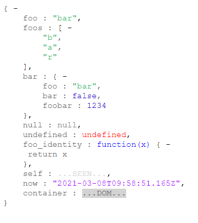
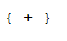

json-tree
=========

simple JS library that creates an html navigable tree from JSON object.

Example
------------

```html
<!DOCTYPE html>
<html lang="en">
<head>
	<title>json tree example</title>
	<link href="src/jsontree.css" rel="stylesheet">
	<script src="src/jsontree.js"></script>
</head>
<body>
	<div id="example"></div>
	<script>
		var obj = {"foo": "bar", "foos": ["b","a","r"], "bar": {"foo":"bar", "bar":false, "foobar":1234}};
		var html_json = JSONTree.create(obj);
		document.getElementById("example").innerHTML = html_json
	</script>
</body>
</html>
```
### Full view



### Collapsed view




